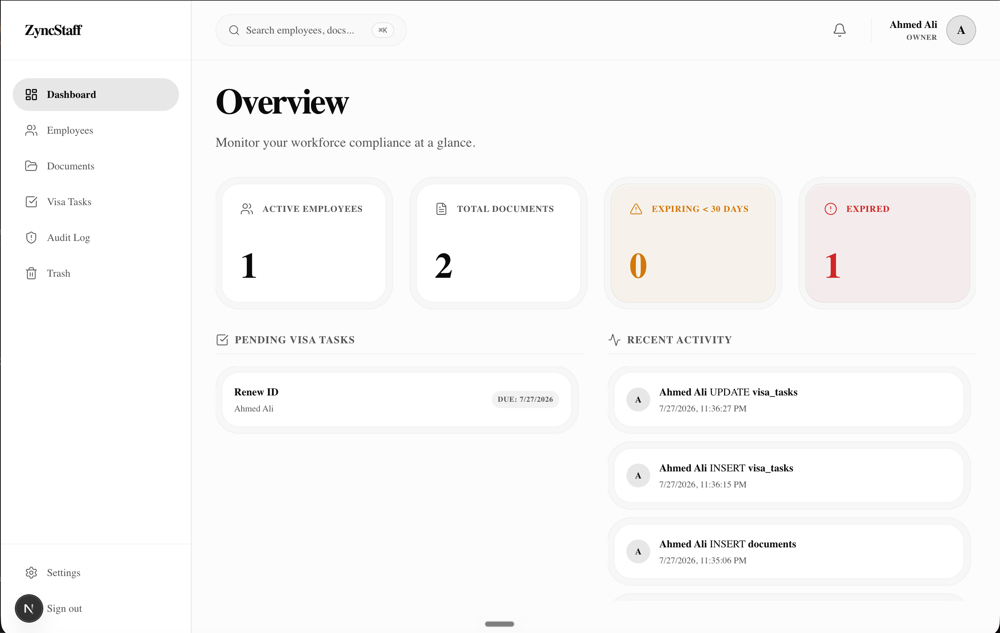

# ZyncStaff

A secure, internal workforce compliance and document management system built for company managers and owners to manage employee KYC documents, monitor expiries, track visa workflows, and maintain full audit trails.



> 📸 [View more screenshots here](./public/screenshots)

## Features

- **Role-Based Access Control** — Owner and Manager roles with granular permissions
- **Employee Profiles** — Searchable directory with compliance scoring
- **Document Management** — Upload, preview, download, version history, and soft-delete
- **AI/OCR Extraction** — Automatic text extraction from scanned documents via Tesseract.js
- **Expiry Monitoring** — Color-coded indicators (Green → Yellow → Orange → Red) with automated email alerts
- **Visa Task Board** — Kanban-style drag-and-drop workflow tracking
- **Procedures Checklist** — Step-by-step procedure tracking with progress bars
- **Audit Log** — Immutable log of all user actions
- **Export Reports** — Export data to CSV, Excel, or PDF
- **Email Notifications** — Automated expiry alerts via Resend (configurable cron)
- **Fully Responsive** — Mobile, tablet, and desktop optimized

## Tech Stack

| Layer | Technology |
|-------|-----------|
| Frontend | Next.js 16, React 19, TypeScript |
| Styling | Tailwind CSS v4, Framer Motion |
| Backend | Supabase (Auth, PostgreSQL, Storage, RLS) |
| Email | Resend API |
| OCR | Tesseract.js |
| Hosting | Vercel |

## Getting Started

### Prerequisites

- Node.js 18+
- A [Supabase](https://supabase.com) project
- A [Resend](https://resend.com) account (for email notifications)

### Installation

```bash
# Clone the repository
git clone https://github.com/your-username/zyncstaff.git
cd zyncstaff

# Install dependencies
npm install

# Set up environment variables
cp .env.example .env.local
# Edit .env.local with your actual credentials

# Run the development server
npm run dev
```

### Database Setup

Run the SQL migration files in order inside your Supabase SQL Editor:

1. `supabase/migrations/0001_initial_schema.sql` — Core tables (profiles, employees, documents, visa_tasks, etc.)
2. `supabase/migrations/0002_create_storage.sql` — Sets up the storage buckets for document uploads
3. `supabase/migrations/0002_procedures_checklist.sql` — Procedures checklist table
4. `supabase/migrations/0003_enable_rls.sql` — Enables Row Level Security (RLS) on all tables
5. `supabase/migrations/0004_audit_log_triggers.sql` — Database triggers for the immutable audit log

### Environment Variables

See [`.env.example`](.env.example) for all required variables.

## Security

- No public registration — users are created by existing owners/managers
- Private Supabase Storage buckets with signed URLs
- Row Level Security (RLS) on all database tables
- Content Security Policy, X-Frame-Options, and other security headers
- Cron endpoints protected by bearer token authentication
- Session-based authentication with Supabase Auth

## License

This project is proprietary software. All rights reserved.
